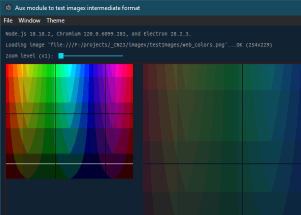

### Auxiliary desktop graphics app for testing imagex intermediate data format

- (cross-platform, Electron.js)

---
 

Alows quick comparison of custom vs browser PNG decoding in each channel:

> notes: 
first time packaging:

npm install --save-dev @electron-forge/cli 
npx electron-forge import 
npm run make 